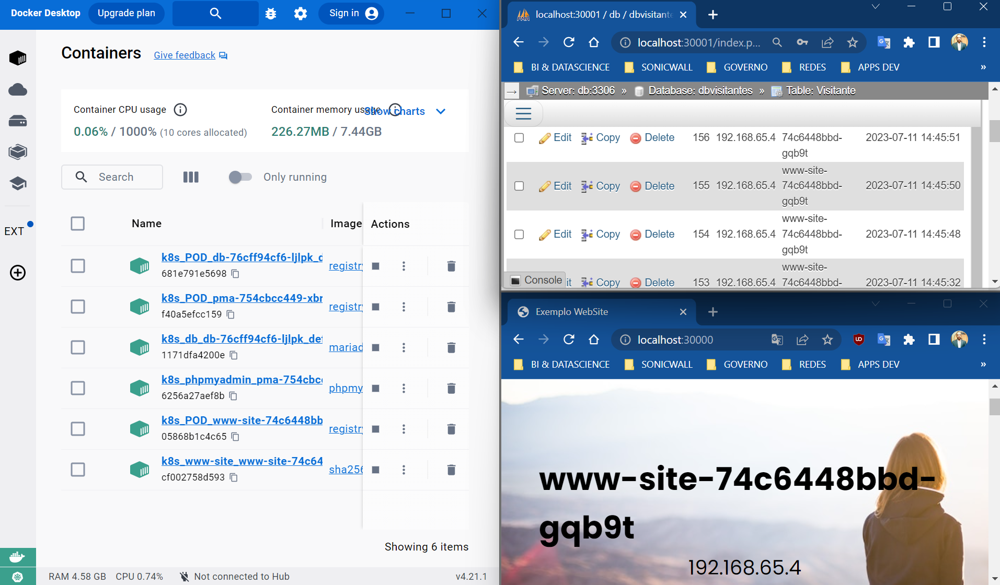

# EXEMPLO 01 - APLICAÇÃO LAMP EM MICROSSERVIÇOS
### Exemplo de aplicação web, utilizando imagens docker e implementação em kubernetes

Apps necessários:
* Windows 11 / Mac OS Monterey
* Docker Desktop com Kubernetes ativado
* IDE VSCode

## Processo de implantação

### Clonar repositório
* git clone https://github.com/gpldevops/testegit1.git
* no vscode, abrir deixar o diretório do clone acima do raiz

### Testar aplicação Single Node com docker-composer
* docker-compose up -d
* via browser
  + http://localhost (app)
  + http://localhost:8081 (phpmyadmin)

### Testar aplicação em microsserviços com kubernetes
* ./meucluster.bat iniciar
* via browser
  + http://localhost (app)
  + http://localhost:8081 (phpmyadmin)
* para aumentar as réplicas dos pods, edite em deployment o número de réplicas

## Github

### Atualizando o git gpldevops/testegit1
* git add .
* git commit -m 'Mensagem referente a atualização'
* git push origin main
  + main é o nome da branch deste exemplo

## Docker
### Gerando a imagem gpldevops/testegit1:vN
* executar o comando ./docker-atualiza.bat criar vN
* vN é o nome da versão, ou seja se a imagem tiver o nome gpldevops/testegit1:v5 o comando será:
  + ./docker-atualiza.bat criar v5
* após a execução do script .bat, as aplicações estão disponíveis via browser na porta 80 (website) e 8081 (phpmyadmin)

## Kubernetes

Vamos entender os manifestos (scripts yaml) que implementarão as nossas aplicações (Website + MariaDB + PHPMyAdmin)
### diretório yaml-maria/
* contém o manifesto **deployment.yaml** que:
  + criará o serviço DB (no caso mariadb server) 
  + implentará um deployment com N pods (réplicas) propostos para executar o mariadb server, com o database e tabela necessária para o exemplo
  + configurará o mapeamento do database inicial necessário
* contém o manifesto **service.yaml** que subirá o serviço na porta padrão 3306
* contém o **volume.yaml** que criará um volume persistente, ou seja, em caso de reinicio do serviço, os dados não serão perdidos
* **importante:** 
  + este repositório é um exemplo simples, com usuário e senha exposto no código
  + uma boa prática é utilizar secrets
  + o container do mariadb terá acesso somente interno (CLUSTER IP), ou seja, somente os serviços do cluster que será criado

### diretório yaml-php/
* contém o manifesto deployment.yaml que:
  + cria o deployment para subir N pods (réplicas) o serviço web
  + esses pods contém uma aplicação web que conecta com o mariadb 
* contém o manifesto service.yaml que cria e sobe o serviço web (apache e php) na porta de acesso 30000
* **importante:**:
  + neste exemplo subiremos o serviço em nodeport, ou seja, além dos hosts do cluster, o seu PC local também terá acesso ao serviço
  + quando subirmos um ambiente kubernetes, essa aplicação tem que estar disponível para a internet ou seja, LoadBalancer (esse mode está no script e comentado). 

### diretório yaml-pma/
* contém o manifesto deployment.yaml que cria o deployment para subir N pods (réplicas) o serviço de PHPMyAdmin
  + PHPMyAdmin é uma aplicação opensource para gerenciar o banco de dados mariadb e se conecta com o mariadb
* contém o manifesto service.yaml que cria e sobe o serviço web (apache e php)
  + subirá o serviço na porta padrão 30001
  + Para esta aplicação estar disponível na internet, terá que fazer a mesma coisa em relação nodePort para LoadBalancer.
  
### Implementando a aplicação
* executar o script mucluster.bat
  + script criado para facilitar a execução dos comandos do kubernetes.
  + será sempre utilizado para subir os manifestos no cluster (manifesto do mariadb, da aplicação web php e da aplicação phpmyadmin)
  + o core deste script está conceituado no comando kubectl para aplicar manifestos yamls ou para excluí-los
* como executar:
  + ./meucluster.bat AÇÃO. Essas ações são:
    + iniciar, implementará toda a aplicação no cluster kubernetes: serviços, deployments e seus pods, PVs e PVCs e replica set
    + parar, para toda a implementação (deleta todos os pods, deployments, servicos e replicasets) mas não deleta os dados
    + excluir, executa o comando parar e exclui definitivamente todos os dados
    + ajuda: exemplifica como executar os comandos como ./container.sh iniciar ou container.bat parar 
* sugiro aprender sobre os comandos kubectl para poder se aproveitar de mais comandos interessantes do kubernetes

**Github Devops - Grupo Paulo Lima - @gpldevops**
